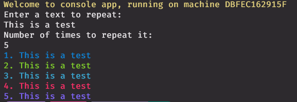

# Docker-Console-App 

This is a NET 7 console app that runs in Docker. The application takes text input and a number of times that the text input may be displayed repeatedly on the screen.

## Setup

Pull image by executing the command below:  
`docker pull kagisho/docker-console-app`

Once the image is pulled, execute the command below to run the container:  
`docker container run -it -t --name docker-console-app kagisho/docker-console-app`

`it` - will run the container in interactive mode to allow of input

## Output of the screen when the app runs

