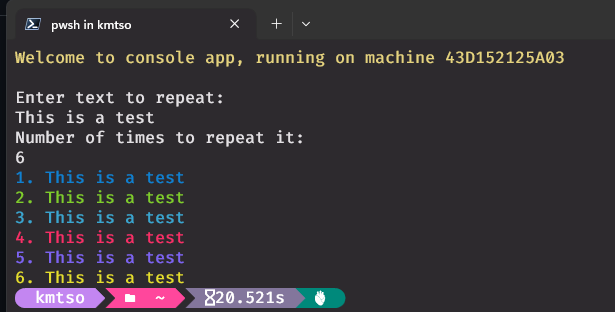

# Docker-Console-App 

This is a NET 7 console app that runs in Docker. The application takes text input and a number of times that the text input may be displayed repeatedly on the screen.

## Setup

Navigate to the root folder of the application and execute command below to build the image:

`docker image build --tag docker-console-app . `

Once the image is built, execute the command below to run the container:
`docker container run -it -t --name docker-console-app docker-console-app`

## Output of the screen when the app runs

